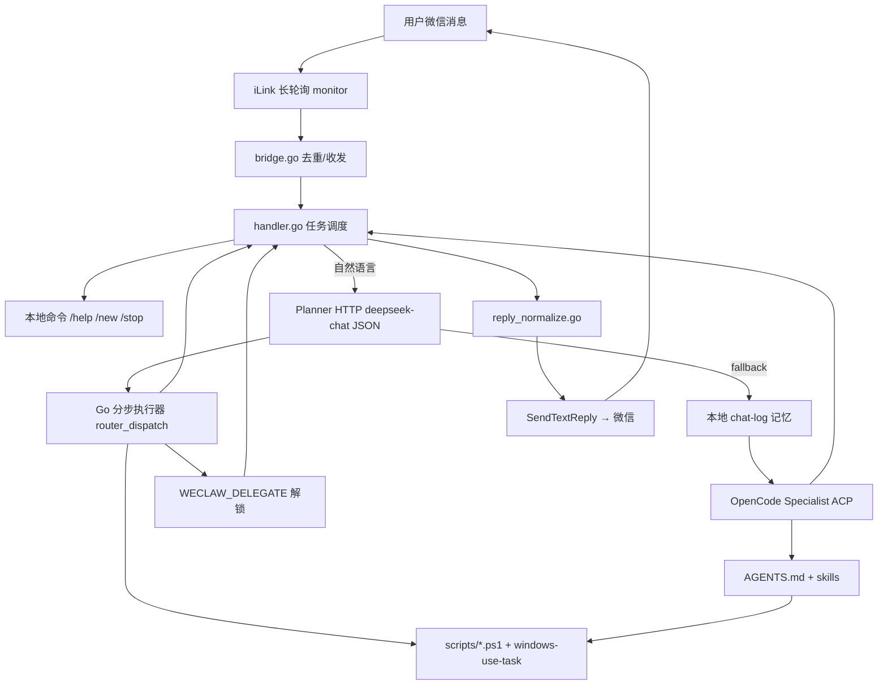
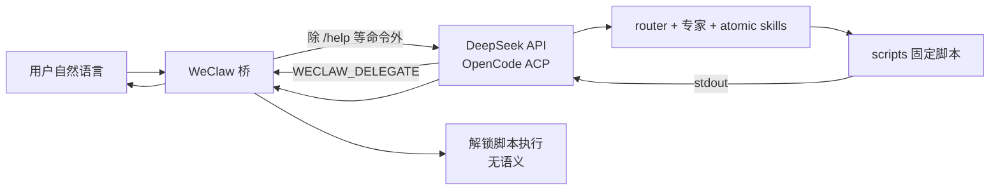

# 微信远程控制 — 架构与运行逻辑

本文档说明 **当前主路径** 的完整数据流、各层职责、意图路由规则，以及历史上同类 bug 的防复发清单。修改路由、回复或脚本前请先读本文。

**当前主路径：** 手机微信 → `weclaw.exe` → **Planner (DeepSeek HTTP JSON)** → 分步执行 / 脚本 → **OpenCode Specialist fallback** → `deepseek/deepseek-v4-flash`

---

## 1. 总览



**设计原则：Planner 理解 + Go 机械执行 + Specialist 按步工人**

| 层 | 职责 | 禁止 |
|----|------|------|
| **Planner (HTTP)** | 语义 → JSON（domain/action/steps）；**无工具** | 跑 bash、改脚本 |
| **WeClaw Go** | 解析 JSON、直跑原子脚本、复合 `steps[]`、GUI(Windows-Use)、解锁执行、回复规范化 | 关键词硬编码路由表 |
| **OpenCode Specialist** | Planner 未覆盖或 `[PLANNER:…]` 步：load skill、**每步 ≤1 bash** | 一轮 10+ tool、英文标题泄露 |
| **scripts/*.ps1** | 机械执行 + `WECHAT_USER_REPLY` / `WECHAT_MEDIA_SENT` | Agent 在聊天里改 unlock 脚本 |

> **§76 恢复并增强：** `messaging/router.go` + `router_dispatch.go` — Planner JSON + 分步执行（非 §47 关键词快路径）。

---

## 2. 启动与配置

```
scripts/start-weclaw.ps1
  ├── keep-awake.ps1          # 防止 S0ix 断连
  ├── wake-server             # 手机唤醒页
  ├── weclaw-watchdog         # 进程守护
  └── weclaw start            # 主桥
```

| 文件 | 作用 |
|------|------|
| `~/.weclaw/config.json` | 默认 agent、progress、unlocker 脚本路径、本地记忆 |
| `scripts/init-weclaw-opencode.ps1` | 写入/合并 config，生成 system_prompt |
| `.opencode/AGENTS.md` | 大脑规则（与 init 的 prompt 一致） |
| `opencode.json` | 禁止 Agent 编辑 unlock 相关脚本 |
| `~/.weclaw/unlock-screen.json` | 锁屏 PIN（不进仓库） |

初始化：`powershell -File scripts/init-weclaw-opencode.ps1`  
重启桥：`powershell -File scripts/restart-weclaw.ps1`

---

## 3. 单条消息的完整生命周期

### 3.1 入站（WeClaw）

1. `ilink/monitor.go` 收到用户消息
2. `handler.go:HandleMessage` 按 `message_id` 去重
3. **本地短路（不经过 LLM）：**
   - 停止 / 取消 → 取消当前 task
   - `/help` `/new` `/clear` `/cwd` `/info` → 固定回复
   - `@agent` / `/agent` → 切换或指定 agent
4. **默认路径：** `sendToDefaultAgent` → `chatWithMemory` → OpenCode ACP

### 3.2 大脑（OpenCode）

1. 注入 `system_prompt`（来自 config）+ 用户消息 + 本地 chat-log 上下文
2. 加载 `.opencode/AGENTS.md` 与对应 **skill**
3. 简单 PC 任务：**一个 skill → 一次 bash → 一个固定脚本**
4. 多步任务：Agent 发 `WECHAT_PROGRESS: …`，桥转发给用户
5. 解锁：**不跑工具**，只输出一行 `WECLAW_DELEGATE: openclaw-unlocker`

### 3.3 解锁委派（WeClaw 独占）

```
Agent 输出 WECLAW_DELEGATE: openclaw-unlocker
        ↓
handler.resolveAgentDelegate
        ↓
powershell unlock-screen.ps1（config 里 unlocker.script_path）
        ↓
normalizeUnlockerReply（优先 WECHAT_USER_REPLY）
        ↓
用户永远看不到 WECLAW_DELEGATE 这一行
```

**为何不能 Agent 自己 bash unlock：** Secure Desktop 下 Agent 鼠标能点密码框，但 **无法注入 PIN**；只有 `unlock-sendkeys.ps1` / hodor pipe 可以。

### 3.4 出站（三层回复规范化）

同一条回复可能经过 **两层** 规范化（故意冗余，防止 Agent 空回复）：

| 顺序 | 位置 | 何时生效 |
|------|------|----------|
| ① | `acp_agent.go:resolveACPAgentReply` | 拼接流式 chunk（用 `""` 不用 `\n`） |
| ② | `acp_agent.go:extractWeChatToolFallback` | Agent 正文为空时，从 tool stdout 兜底 |
| ③ | `handler.go:NormalizeWeChatReply` | **发送微信前最后一道门** |

**优先级（③ 与 ② 相同逻辑）：**

1. `WECHAT_STOCK_CARD:` → 原样 4–5 行卡片
2. `WECHAT_USER_REPLY:` → **原样**固定中文句（最高优先级的人类文案）
3. `WECHAT_OK:` / `WECHAT_FAIL:` → 映射到 AGENTS 模板表
4. 否则 → Agent 原文（去 Markdown）

---

## 4. 意图路由表（Planner JSON + Specialist fallback）

WeClaw **不做**关键词路由；下表由 **Planner (DeepSeek HTTP)** 输出 JSON，Go **机械执行**；Specialist 仅 fallback。

| 用户意图（示例） | Planner action / steps | 执行层 | 固定回复 |
|------------------|------------------------|--------|----------|
| 截图 / 截屏 | `screenshot` | Go 直跑 `screenshot.ps1` | **无文字**（`WECHAT_MEDIA_SENT`） |
| 看屏幕 / 检索 / OCR / 网盘进度 | `ocr` 或 `[gui, ocr]` | Go 直跑 + HTTP 一句总结 | `屏幕上主要是：{≤40字}` |
| 亮屏 / 开屏 | `wake` | Go 直跑 | `屏幕已点亮。` |
| 关屏 / 熄屏 | `off` | Go 直跑 | `显示器已关闭。` |
| 解锁 / 进桌面 | `unlock` | Go 委派 unlock | `已解锁，请看屏幕。` |
| 股票 / 持仓 | `stock` | Go 直跑 | 原样 `WECHAT_STOCK_CARD` |
| RustDesk / 百度网盘 / 未知 App | `gui` 或 steps | `windows-use-task.ps1` | `已完成：…` |
| 复合（打开+截图） | `steps[]` | Go 逐步 + 可选 Specialist | `已完成：…` |
| 放歌 / 打开文件 | `music` / `open_file` | Go 或 Specialist 一步 | 见 AGENTS 模板 |

### 易混意图（历史 bug 高发区）

| 用户说 | 正确路由 | 错误路由 |
|--------|----------|----------|
| **检索屏幕** / 看屏幕上有什么 | OCR → `screen-ocr.ps1` | 解锁 / 截图 |
| **截图** | `screenshot.ps1` | 解锁（因误读 `WECHAT_OK: 已唤醒显示器`） |
| **关屏幕** | `turn-off-screen.ps1` | 解锁 |
| **锁屏**（无「解」） | 锁定电脑（非本仓库主流程） | 解锁委派 |
| **解锁** | `WECLAW_DELEGATE` | Agent bash unlock / 截图点击 |

---

## 5. 脚本 stdout 协议

所有展示类脚本应输出：

```text
WECHAT_OK: …          # 机器成功标记（可选，供映射）
WECHAT_USER_REPLY: …  # 人类固定句（优先采用，Agent 须原样转发）
WECHAT_FAIL: …        # 失败原因
WECHAT_STOCK_CARD:    # 股票专用，下一行起为卡片正文
WECHAT_DATA: …        # 诊断用，不展示
```

Agent 专用（非脚本）：

```text
WECHAT_PROGRESS: …    # 进度，桥单独转发
WECLAW_DELEGATE: openclaw-unlocker   # 解锁委派，用户不可见
```

**编码：** 含中文的 `.ps1` 必须 UTF-8 BOM + `. scripts/utf8-console.ps1`；Agent **禁止凭记忆重打中文**。

---

## 6. 规范脚本 vs 实验脚本

**仅 AGENTS 路由表中的脚本是 canonical。** 仓库内下列文件 **不得** 被 Agent 调用：

- `direct-unlock.ps1` / `direct_unlock.ps1` / `unlock-fix.ps1`
- `close-screen.ps1`（仅转发，应直接用 `turn-off-screen.ps1`）
- 根目录 `_task_*.txt`、`.opencode/_task_*`（调试垃圾）

---

## 7. 历史 bug 与防复发清单

| # | 现象 | 根因 | 防护 |
|---|------|------|------|
| 1 | 每个字一行 | `Join(parts, "\n")` | 必须用 `Join(parts, "")` |
| 2 | 中文乱码 | PS5.1 GBK stdout | UTF-8 BOM + `utf8-console.ps1` |
| 3 | 截图回「已解锁」 | 任意 `WECHAT_OK`→解锁 | 只映射明确类型；优先 `WECHAT_USER_REPLY` |
| 4 | 检索变解锁 | skill/AGENTS 歧义 | 「检索」默认 OCR；unlock skill 禁止 OCR 触发词 |
| 5 | unlock 语法错误 | ps1 编码损坏 | BOM 保存；`opencode.json` 禁止 Agent 改 unlock 脚本 |
| 6 | 解锁假失败 | verify 最后 `return false` | 非锁屏前台视为已解锁 |
| 7 | Agent 空回复 | tool 跑了但没说话 | `extractWeChatToolFallback` + `NormalizeWeChatReply` |
| 8 | 关屏后断连 | 显示器 off 断网 | `turn-off-screen` 前 pin execution state + keep-awake |
| 9 | 英文 tool 标题泄露微信 | ACP `update.Title` 当回复 | `isLeakedEnglishToolTitle` 过滤；禁止 Specialist 多 tool |
| 10 | 网盘/RustDesk 乱选 screenshot | 无 GUI 能力 | Planner `gui` + `windows-use-task.ps1` |
| 11 | 复合任务 brain stall | 一轮 10+ tool | Go `steps[]` 分步；Specialist max 3 bash |

**改代码前自检：**

- [ ] 新脚本是否输出 `WECHAT_USER_REPLY`？
- [ ] AGENTS、对应 skill、init prompt 三处措辞是否一致？
- [ ] `MapWeChatOKLine` 是否新增了「过于宽泛」的匹配？
- [ ] 解锁是否仍只走 `WECLAW_DELEGATE`？
- [ ] 流式回复拼接是否仍用 `""` 而非 `"\n"`？

---

## 8. 调试

| 资源 | 路径 |
|------|------|
| 桥日志 | `~/.weclaw/weclaw.log` |
| 对话记忆 | `~/.weclaw/chat-log/*.jsonl` |
| 解锁调试 | `%TEMP%\unlock_screen_*.log` |
| 状态 | `scripts/status.ps1` |
| VPN/iLink | `docs/weclaw-vpn.md` |

微信侧卡住：先发 **`/new`** 清 OpenCode 会话；本地 chat-log 仍保留，无需「开新对话框」。

---

## 9. 与遗留方案对比

| | 遗留 `wechat-local-chat` | 当前 WeClaw + OpenCode |
|--|--------------------------|-------------------------|
| 桥 | Node `index.mjs` | Go `weclaw.exe` |
| 大脑 | Ollama 本地 | OpenCode ACP 云模型 |
| 路由 | Node 侧关键词 | **仅大脑**（WeClaw 不分类） |
| 解锁 | 无标准流程 | `WECLAW_DELEGATE` + 固定脚本 |

`router.js` / `agent.js` **不属于当前主路径**，仅出现在历史文档中。

---

## 10. 单 API 原则（强制 — 全语义经 DeepSeek）

**你只有一条 DeepSeek API；所有自然语言理解必须走 OpenCode ACP，不能绕开。**



### 10.1 谁做语义、谁不做

| 组件 | 是否调用 DeepSeek | 做什么 |
|------|-------------------|--------|
| **OpenCode ACP** | **是（唯一）** | 理解中文、选域、load skill、调 bash、写回复 / 委派行 |
| **WeClaw handler** | **否** | 去重、/命令、记忆注入、进度转发、**执行**解锁脚本、回复规范化 |
| **scripts/*.ps1** | **否** | 机械执行，输出 `WECHAT_USER_REPLY` |
| **reply_normalize.go** | **否** | 格式映射，**不改变意图** |

### 10.2 允许不经 API 的操作（白名单）

仅限 **无自然语言理解** 的机械步骤：

1. `/help` `/new` `/cwd` `/info` / 停止取消  
2. 消息去重、typing、进度原样转发  
3. 大脑 **已输出** `WECLAW_DELEGATE: openclaw-unlocker` 之后 → 跑 `unlock-screen.ps1`  
4. 发送前提取 `WECHAT_USER_REPLY` / CARD / OK 映射  

**禁止加入白名单：**

- 按关键词选 `screenshot.ps1` / `screen-ocr.ps1`（已删除的 `simple_bypass` 思路）  
- 桥接根据「检索」二字直跑 OCR  
- 第二个 LLM / 本地小模型做意图分类  
- `WECLAW_DELEGATE: screen-agent` 直跑截图脚本（语义须先经 DeepSeek）

### 10.3 `WECLAW_DELEGATE` 的正确含义

```
DeepSeek 理解「要解锁」 → 输出 WECLAW_DELEGATE
                              ↓（此时 API 已完成语义）
                         WeClaw 只跑 PIN 脚本
```

**委派 = 执行层外包，不是语义层外包。** 若桥接替大脑决定「这是解锁」，就绕开了 API，必然易错。

---

## 11. 多 Agent 模型（单 API 内的专家分工）

与 Marvis 的差异：**不是 6 个 LLM，而是 1 个 DeepSeek 会话里 load 6 套专家 skill。**

```
用户消息
  → DeepSeek（一次 API 会话）
       → load weclaw-router        ← 分类（仍是 DeepSeek 在读）
       → load weclaw-screen-agent  ← 域规则（仍是 DeepSeek 在读）
       → load wechat-screenshot      ← 原子动作
       → bash screenshot.ps1
       → DeepSeek 组织回复
  → WeClaw 规范化 → 微信
```

| 概念 | 是什么 | 不是什么 |
|------|--------|----------|
| Router | skill 文件名，大脑先 load | Go 程序、关键词表 |
| ScreenAgent | `weclaw-screen-agent` skill | 第二个 API、@screen 子进程 |
| Atomic skill | `wechat-screenshot` 等 | 独立 LLM |
| Orchestrator | 复合任务协议 skill | 并行多大脑 |

**复合任务：** 仍在 **同一会话** 内 Plan → Act → Verify → Report；Progress 可写 `[ScreenAgent] 正在截图` 给用户分工感。

**若未来要多 ACP 进程：** 每个进程仍应调用 **同一 DeepSeek 模型**；Router 进程只做分类，但 **仍是一次 API 调用**，不能改成 Go 关键词。在当前「只有一个 API」约束下，**不建议**上多 ACP，专家 skill 方案足够。

### 11.1 三层结构（与 Marvis 对齐的部分）

| 层 | 本项目的实现 | 语义是否经 DeepSeek |
|----|--------------|---------------------|
| 总控 | `weclaw-router` skill | **是** |
| 专家 | `weclaw-*-agent` skills | **是**（同会话 load） |
| 执行器 | `scripts/*.ps1` + unlock 委派执行 | **否**（固定脚本） |

### 11.2 防混乱规则（单 API 版）

1. **路由表只存在于** `weclaw-router` + 专家 skill + AGENTS；Go 不增加 intent 表。  
2. **init system_prompt** 只写原则（单 API、先 router、解锁委派），不重复整张路由表。  
3. **专家 skill 只写本域**；Screen 禁止 unlock，Sys 禁止 OCR。  
4. **简单任务** router → 一专家 → 一 bash；**复合任务** 才 load orchestrator。  
5. 任何「为了省 API 在桥里加规则」的改动 — **拒绝**。

